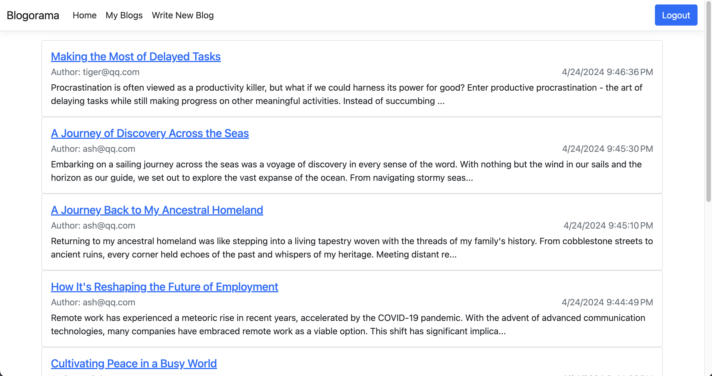
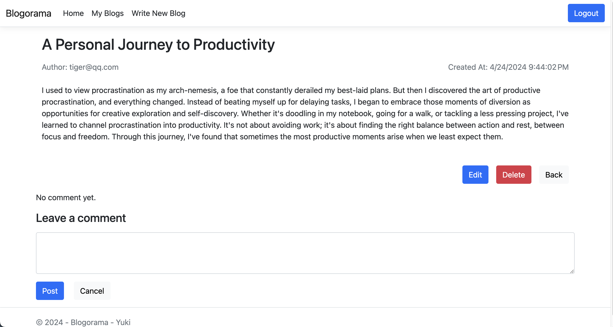
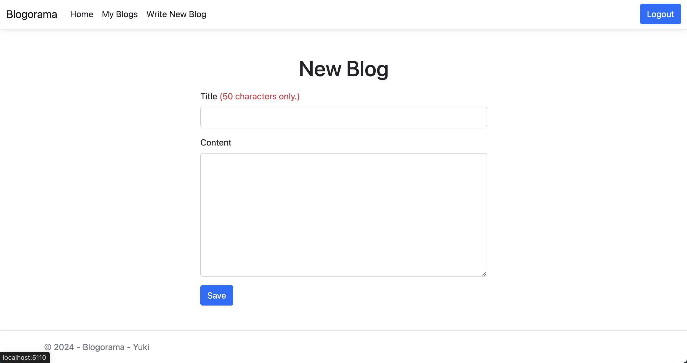
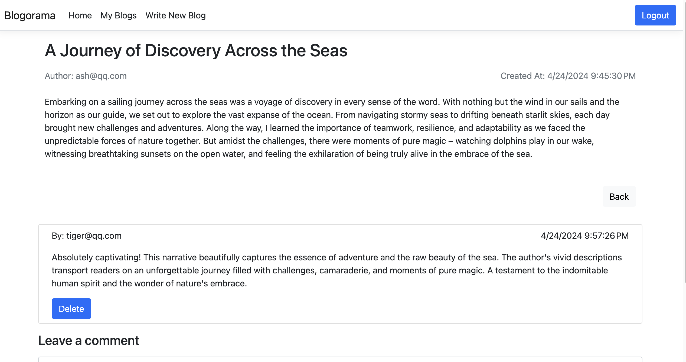
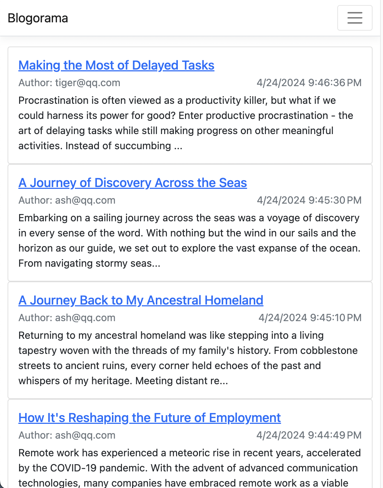

# Blogorama

### **Application Summary**

---

Blogorama is a web application that allows users to create and manage their blogs. Users can register, log in, and create blog posts. They can also view, edit, and delete their own posts. Additionally, users can leave comments on blog posts created by others.

### **Technologies used**

---

- Responsive Web Design
- ASP.NET Core , ASP.NET Identity
- Entity Framework Core
- SQL Server , Bootstrap

### **App screenshot**

---

